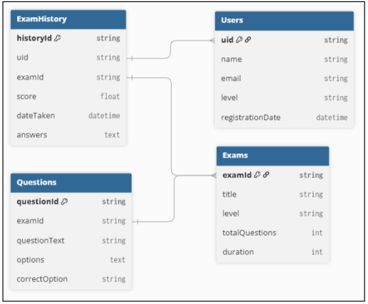
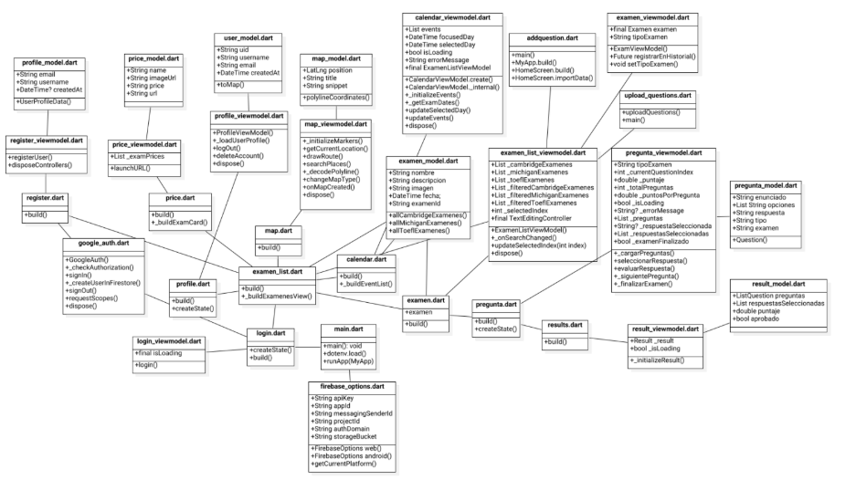
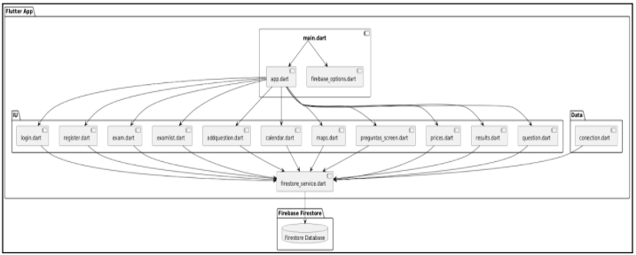
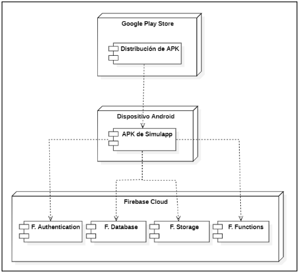

<!-- Intro -->
# Simulapp
 

### Curso  
Patrones de Software

### Integrantes
- **Cabrera Catari, Camila Fernanda** — (2021069824)  
- **Melendez Huarachi, Gabriel Fari** — (2021070311)  

---

## 🧾 Descripción del Sistema

SimulApp es una aplicación móvil diseñada para ayudar a los usuarios en la preparación de exámenes de certificación de inglés. La aplicación proporciona un entorno interactivo donde los usuarios pueden practicar simulaciones de exámenes, acceder a recursos educativos, consultar fechas de exámenes y comparar precios de diferentes institutos. Además, permite registrar el progreso de cada usuario, almacenando su historial de resultados y facilitando un aprendizaje personalizado y efectivo.

---

## 🗃️ Diagrama de Base de Datos

Representación de las entidades principales y sus relaciones.

---

## 🧱 Diagrama de Clases

Estructura de clases y relaciones en el sistema orientado a objetos.

[Link SVG](https://drive.google.com/file/d/1FtS_QWn8ehIFIr6cSHLHNYjQNColNmbI/view)

---

## 🧩 Diagrama de Componentes

Componentes clave del sistema y sus interacciones lógicas.

---

## 🚀 Diagrama de Despliegue

Representación física del sistema en el entorno de producción.

