

[comment]: 

**UNIVERSIDAD PRIVADA DE TACNA**

**FACULTAD DE INGENIERIA**

**Escuela Profesional de Ingeniería de Sistemas**

**Proyecto *Simulapp***

Curso: *Patrones de Software*

Docente: *Mag. Patrick Cuadros Quiroga*

Integrantes:

***Cabrera Catari, Camila Fernanda           (2021069824)***
***Melendez Huarachi, Gabriel Fari            (2021070311)***

**Tacna – Perú**

***2025***

**  
**

\pagebreak

Sistema *Simulapp*

Informe de Factibilidad

Versión *{1.0}*

|CONTROL DE VERSIONES||||||
| :-: | :- | :- | :- | :- | :- |
|Versión|Hecha por|Revisada por|Aprobada por|Fecha|Motivo|
|1\.0|CCC|GMH|-|09/09/2025|Versión Original|

\pagebreak

# **INDICE GENERAL**

[1. Descripción del Proyecto](#_Toc52661346)

[2. Riesgos](#_Toc52661347)

[3. Análisis de la Situación actual](#_Toc52661348)

[4. Estudio de Factibilidad](#_Toc52661349)

[4.1 Factibilidad Técnica](#_Toc52661350)

[4.2 Factibilidad económica](#_Toc52661351)

[4.3 Factibilidad Operativa](#_Toc52661352)

[4.4 Factibilidad Legal](#_Toc52661353)

[4.5 Factibilidad Social](#_Toc52661354)

[4.6 Factibilidad Ambiental](#_Toc52661355)

[5. Análisis Financiero](#_Toc52661356)

[6. Conclusiones](#_Toc52661357)

\pagebreak

**<u>Informe de Factibilidad</u>**

1. **Descripción del Proyecto**

    1.1. Nombre del proyecto: Simulapp

    1.2. Duración del proyecto: 4 meses

    1.3. Descripción

        El proyecto Simulapp consiste en el desarrollo de una aplicación móvil y web que ofrece a los usuarios la posibilidad de realizar simulacros de exámenes de inglés estandarizados y reconocidos a nivel internacional, como el CAE y el TOELF. La aplicación permitirá a los estudiantes familiarizarse con el formato, la estructura y el tiempo de los exámenes, proporcionándoles una herramienta de práctica integral. El contexto en el que se desenvolverá es el creciente mercado de la educación en línea y la demanda de herramientas de autoaprendizaje para la preparación de exámenes de idioma.

    1.4. Objetivos

        1.4.1 Objetivo general
        Desarrollar y lanzar una aplicación funcional y rentable que ofrezca simulacros de exámenes internacionales de inglés, proporcionando una herramienta de estudio accesible y eficaz para los estudiantes.
        1.4.2 Objetivos Específicos
                - Desarrollar la funcionalidad principal: Crear un sistema de simulacros con módulos de listening, reading, writing y speaking que repliquen la experiencia de los exámenes reales.

                - Implementar un sistema de calificación automática: Integrar un algoritmo que evalúe las respuestas de las secciones de opción múltiple y ofrezca retroalimentación inmediata.

                - Diseñar una interfaz de usuario intuitiva: Crear una experiencia de usuario amigable y fácil de navegar, optimizada para dispositivos móviles y web.

                - Asegurar la estabilidad y seguridad: Implementar medidas para proteger los datos de los usuarios y garantizar la fiabilidad del servicio.   

\pagebreak

2. **Riesgos**

    - Competencia en el mercado: Existen otras plataformas similares que ofrecen servicios de preparación de exámenes de inglés. El riesgo es no diferenciarse y no atraer a la audiencia objetivo.
    - Costos no previstos: Posibilidad de que los costos de desarrollo o licenciamiento de contenido superen el presupuesto inicial.
    - Adopción del usuario: Que la aplicación no sea bien recibida o que no alcance el número de usuarios esperados.
    - Problemas técnicos: Dificultades técnicas durante el desarrollo o fallos en la aplicación después del lanzamiento.

\pagebreak

3. **Análisis de la Situación actual**

    3.1. Planteamiento del problema

            Describa antecedentes y situación actual, explicando la problemática y/o necesidad que será resuelta con el proyecto propuesto.

    3.2. Consideraciones de hardware y software

            Hardware y software posibles para la implementación, se analizara lo que existe y es alcanzable, se evaluara que tecnología se puede > utilizar en el proyecto.

\pagebreak

4. **Estudio de
    Factibilidad**

    Describir los resultados que esperan alcanzar del estudio de factibilidad, las actividades que se realizaron para preparar la evaluación de factibilidad y por quien fue aprobado.

    4.1. Factibilidad Técnica

        El desarrollo de Simulapp es técnicamente viable. Las tecnologías necesarias (desarrollo de aplicaciones móviles y web, bases de datos en la nube, servicios de IA para procesamiento de lenguaje natural) están maduras y son ampliamente accesibles. Se cuenta con el conocimiento y las herramientas para implementar todas las funcionalidades planeadas. El hardware requerido para el desarrollo y despliegue del proyecto es estándar y alcanzable (computadoras de desarrollo, servidores en la nube).

4.2. Factibilidad Económica

        El proyecto es económicamente factible, con una inversión inicial para el desarrollo, marketing y mantenimiento. El modelo de negocio se basará en una suscripción mensual o anual, lo que generará ingresos recurrentes.

        Definir los siguientes costos:

        4.2.1. Costos Generales

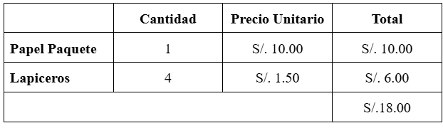
    Tabla 01. Tabla de costos generales para el desarrollo de simulapp. 
    Fuente. Elaboración propia

        4.2.2. Costos operativos durante el desarrollo 
        
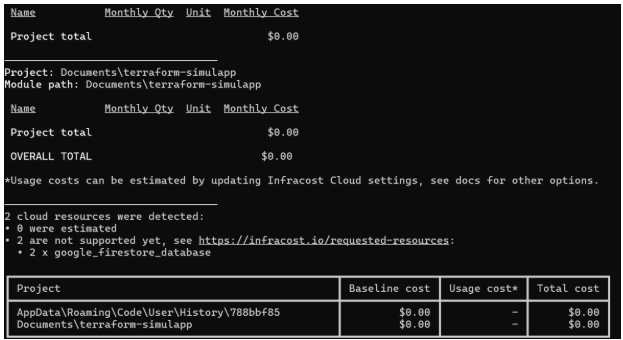

Nota. Imagen de los costos realizados por infracost para Simulapp. 
Fuente. Elaboración propia

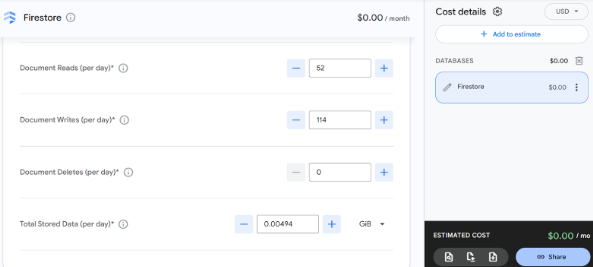

Nota. Imagen de los costos realizados por Google Cloud Pricing Calculator. para Simulapp. 
Fuente. Elaboración propia

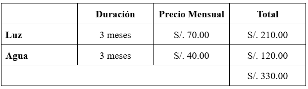

Tabla 02. Tabla de costos operativos para el desarrollo de simulapp. 
  Fuente. Elaboración propia

        4.2.3. Costos del ambiente

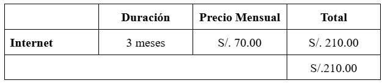
                  
Tabla 03. Tabla de costos del ambiente para simulapp. 
Fuente. Elaboración propia

        4.2.4. Costos de personal

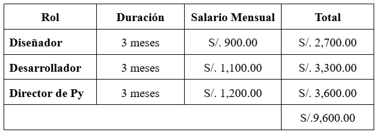
                	 
Tabla 04. Tabla de costos de personal para simulapp. 
           Fuente. Elaboración propia

        4.2.5.  Costos totales del desarrollo del sistema

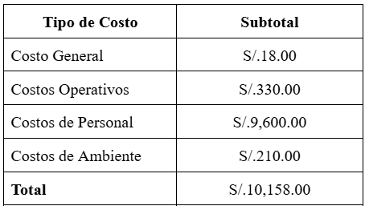
 Tabla 06. Detalle de costos totales para el desarrollo de Simulapp.
        Fuente. Elaboración propia

4.3. Factibilidad Operativa

        El proyecto es operativamente factible. La aplicación está diseñada para ser escalable y de bajo mantenimiento una vez lanzada. Los beneficios para el cliente son la reducción de costos en comparación con otras opciones de estudio y la flexibilidad para practicar en cualquier momento y lugar. El equipo estará en capacidad de mantener el sistema con un mínimo de personal post-lanzamiento.

4.4. Factibilidad Legal

        No se han identificado conflictos legales con el proyecto. Sin embargo, será necesario asegurar que el contenido utilizado para los simulacros (ejercicios, preguntas) no infrinja derechos de autor. Se creará contenido original y se verificará el cumplimiento de las regulaciones de protección de datos.

4.5. Factibilidad Social 

        El proyecto tiene una alta factibilidad social. Aborda una necesidad real del mercado y facilita el acceso a la educación. La aplicación promoverá la igualdad de oportunidades al ofrecer una herramienta de estudio asequible.

4.6. Factibilidad Ambiental

        El proyecto tiene un impacto ambiental nulo o positivo, al ser un producto digital que no requiere de recursos físicos significativos y reduce la necesidad de materiales impresos para el estudio.

\pagebreak

5. **Análisis Financiero**

    5.1. Justificación de la Inversión

        5.1.1. Beneficios del Proyecto

            Beneficios Tangibles: Generación de ingresos recurrentes a través de suscripciones, reducción de costos de preparación para los usuarios.
            Beneficios Intangibles: Mejora de la imagen de la empresa (Upta) como innovadora en el sector educativo, acceso a un mercado global, creación de una comunidad de usuarios, oportunidad de expansión a otros exámenes.

        
        5.1.2. Criterios de Inversión
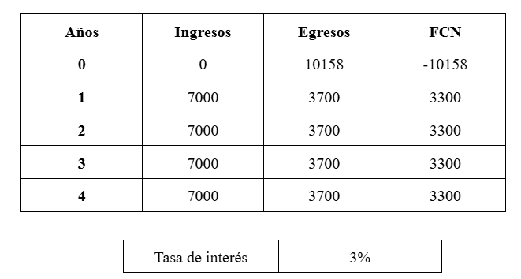
                
Tabla 07. Tabla del flujo neto del desarrollo de la aplicación. 
Fuente. Elaboración propia

            5.1.2.1. Relación Beneficio/Costo (B/C)
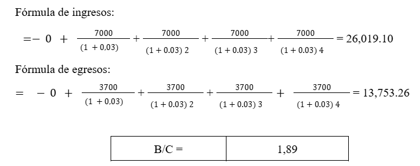
Este indicador compara los beneficios actualizados frente a los costos actualizados del proyecto.
En este caso, los ingresos actualizados alcanzan S/ 26,019.10 y los egresos actualizados S/ 13,753.26, lo que da como resultado un B/C = 1.89.
Esto significa que por cada sol invertido se obtienen 1.89 soles de beneficio, por lo tanto el proyecto es rentable.

            5.1.2.2. Valor Actual Neto (VAN)
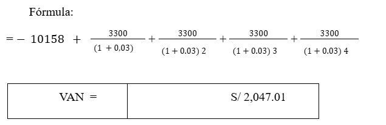
                

            5.1.2.3 Tasa Interna de Retorno (TIR)*
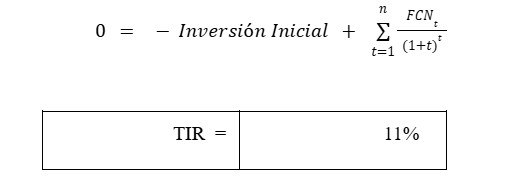

La TIR representa la tasa de descuento que hace que el VAN sea igual a cero. En este caso, la TIR calculada es de 11%, lo cual supera la tasa de interés considerada (3%).
Esto indica que el proyecto ofrece una rentabilidad interna superior al costo de oportunidad, siendo atractivo y viable.

\pagebreak

6. **Conclusiones**

El análisis de factibilidad realizado para el proyecto Simulapp demuestra que este cumple de manera favorable con los criterios evaluados en los ámbitos técnico, económico, operativo, legal y social, lo que permite concluir que su ejecución es viable y recomendable.
Desde la perspectiva económica y financiera, los indicadores de evaluación evidencian la rentabilidad del proyecto. La Relación Beneficio/Costo (B/C = 1.89) confirma que por cada sol invertido se obtiene un retorno casi duplicado, lo cual valida la eficiencia del uso de los recursos. Asimismo, el Valor Actual Neto (VAN = S/ 2,047.01) es positivo, lo que implica que la inversión genera valor adicional para los inversionistas. La Tasa Interna de Retorno (TIR = 11%) supera ampliamente la tasa de interés de referencia (3%), consolidando la capacidad del proyecto para generar beneficios por encima del costo de oportunidad. Finalmente, el Periodo de Retorno de la Inversión (4 años, 10 meses y 2 días) se encuentra dentro del horizonte de vida útil del proyecto, asegurando que la inversión se recuperará en un plazo razonable y comenzará a generar utilidades sostenibles.
En el plano operativo, se confirma que los recursos tecnológicos y humanos disponibles son suficientes para el desarrollo y la implementación de la solución, garantizando que las operaciones del sistema se ejecuten con eficiencia. En cuanto al aspecto legal, el proyecto no presenta restricciones normativas que limiten su desarrollo, ya que cumple con la legislación vigente en materia de propiedad intelectual, contratos y regulaciones aplicables. A nivel social, se espera un impacto positivo, ya que el sistema contribuirá a mejorar procesos internos, optimizar tiempos de respuesta y ofrecer un servicio de mayor calidad a los usuarios, generando aceptación y satisfacción.
En conclusión, el proyecto Simulapp no solo resulta factible desde todas las dimensiones evaluadas, sino que además se configura como una oportunidad estratégica de inversión. Por tanto, se recomienda avanzar con la fase de desarrollo e implementación, asegurando un adecuado seguimiento en la gestión de riesgos y una planificación eficiente de los recursos, a fin de maximizar los beneficios esperados y consolidar el éxito del proyecto en el corto y mediano plazo.
