

[comment]: 

**UNIVERSIDAD PRIVADA DE TACNA**z*

**FACULTAD DE INGENIERÍA**

**Escuela Profesional de Ingeniería de Sistemas**

**Plataforma Móvil de Exámenes de Simulacro de Exámenes de Certificación de Inglés “Simulapp"**

Curso: Patrones de Software

Docente: *Mag. Patrick Cuadros Quiroga*

Integrantes:

 ***Cabrera Catari, Camila Fernanda  (2021069824)***  
***Melendez Huarachi, Gabriel Fari   (2021070311)***  

**Tacna – Perú**  
**2025**

---

**Plataforma Móvil de Exámenes de Simulacro de Exámenes de Certificación de Inglés “Simulapp**

**Documento de Especificación de Requerimientos de Software**

**Versión *1.0***

|CONTROL DE VERSIONES||||||
| :-: | :- | :- | :- | :- | :- |
|Versión|Hecha por|Revisada por|Aprobada por|Fecha|Motivo|
|1\.0|CCC|GMH|-|09/09/2025|Versión Original|
---

**ÍNDICE GENERAL**

[Introducción](#introducción)

[I. Generalidades de la Empresa](#generalidades-de-la-empresa)

[1\. Nombre de la Empresa](#nombre-de-la-empresa)

[2\. Visión](#visión)

[3\. Misión](#misión)

[4\. Organigrama](#organigrama)

[II. Visionamiento de la Empresa](#visionamiento-de-la-empresa)

[1\. Descripción del Problema](#descripción-del-problema)

[2\. Objetivos de Negocios](#objetivos-de-negocios)

[3\. Objetivos de Diseño](#objetivos-de-diseño)

[4\. Alcance del proyecto](#alcance-del-proyecto)

[5\. Viabilidad del sistema](#viabilidad-del-sistema)

[6\. Información obtenida del Levantamiento de Información](#información-obtenida-del-levantamiento-de-información)

[III. Análisis de Procesos](#análisis-de-procesos)

[a) Diagrama del Proceso Actual \- Diagrama de actividades](#diagrama-del-proceso-actual---diagrama-de-actividades)

[b) Diagrama del Proceso Propuesto \- Diagrama de actividades Inicial](#diagrama-del-proceso-propuesto---diagrama-de-actividades-inicial)

[IV. Especificación de Requerimientos de Software](#especificación-de-requerimientos-de-software)

[a) Cuadro de Requerimientos Funcionales Inicial](#cuadro-de-requerimientos-funcionales-inicial)

[b) Cuadro de Requerimientos No Funcionales](#cuadro-de-requerimientos-no-funcionales)

[c) Cuadro de Requerimientos Funcionales Final](#cuadro-de-requerimientos-funcionales-inicial)

[d) Reglas de Negocio](#reglas-de-negocio)

[V. Fases de Desarrollo](#fases-de-desarrollo)

[1\. Perfiles de Usuario](#perfiles-de-usuario)

[2\. Modelo Conceptual](#modelo-conceptual)

[a) Diagrama de Paquetes](#diagrama-de-paquetes)

[b) Diagrama de Casos de Uso](#diagrama-de-casos-de-uso)

[c) Escenarios de Caso de Uso (Narrativa)](#escenarios-de-caso-de-uso-\(narrativa\))

[3\. Modelo Lógico](#modelo-lógico)

[a) Análisis de Objetos](#análisis-de-objetos)

[b) Diagrama de Actividades con Objetos](#diagrama-de-actividades-con-objetos)

[c) Diagrama Secuencia](#diagrama-secuencia)

[d) Diagrama de Clases](#diagrama-de-clases-\(link-a-diagrama-de-clases\))

[Conclusiones](#conclusiones)

[Recomendaciones](#recomendaciones)

---

## **Documento de Especificación de Requerimientos de Software**

### **Introducción** {#introducción}

El presente documento de Especificación de Requerimientos de Software (ERS) tiene como objetivo definir de manera clara y detallada los requerimientos funcionales y no funcionales del sistema Simulapp, una aplicación diseñada para simular exámenes de certificación de inglés reconocidos internacionalmente, tales como CAE y TOEFL. Este documento servirá como guía principal para el equipo de desarrollo, asegurando que todas las funcionalidades y criterios de calidad sean comprendidos y aplicados durante el ciclo de vida del proyecto.

Simulapp permitirá a los estudiantes practicar de manera interactiva y efectiva, replicando fielmente la estructura, formato y tiempos de los exámenes reales.

---

1. #### **Generalidades de la Empresa** {#generalidades-de-la-empresa}

   1. ##### **Nombre de la Empresa** {#nombre-de-la-empresa}

      Plataforma móvil de simulacro de exámenes de certificación de inglés “Simulapp”

   2. ##### **Visión** {#visión}

      "Ser la aplicación líder en el mercado global para la preparación de certificaciones de inglés, reconocida por su innovación, precisión y compromiso con el éxito de sus usuarios. Aspiramos a empoderar a millones de personas a través de herramientas educativas avanzadas, contribuyendo al desarrollo personal y profesional en un mundo cada vez más interconectado."

   3. ##### **Misión** {#misión}

      "Proveer una plataforma móvil accesible y de alta calidad que ofrezca simulacros realistas de exámenes de certificación de inglés. Nuestro objetivo es facilitar la preparación efectiva de nuestros usuarios, mejorando sus habilidades lingüísticas y aumentando su confianza para alcanzar sus metas académicas y profesionales."

   4. ##### **Organigrama** {#organigrama}

   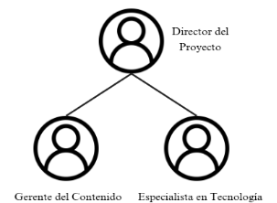
   
   **Gráfico 01\.** Organigrama.
   ***Fuente:** Elaboración propia.*

---

2. #### Visionamiento de la Empresa

   1. ##### **Descripción del Problema** {#descripción-del-problema}

      En la actualidad, las personas que desean obtener una certificación en inglés enfrentan varios desafíos en su preparación. Primero, existen pocos recursos centralizados que combinen la práctica de simulaciones de exámenes con la información detallada sobre las instituciones que los certifican, sus precios y fechas. Además, los usuarios suelen experimentar dificultades para organizar y planificar su preparación de manera eficiente debido a la falta de acceso a herramientas prácticas y a información clave en un solo lugar. Esto hace que el proceso sea desorganizado, costoso y, a menudo, confuso, limitando el acceso a la certificación para muchos estudiantes y profesionales.

   2. ##### **Objetivos de Negocios** {#objetivos-de-negocios}
   - Facilitar el acceso a simulaciones de exámenes de certificación en inglés, ofreciendo una experiencia realista y eficaz para que los usuarios puedan prepararse adecuadamente.

   - Proporcionar información detallada y comparativa sobre instituciones certificadoras, precios y fechas de exámenes para que los usuarios puedan tomar decisiones informadas y organizar su preparación.

   - Aumentar la accesibilidad y eficiencia en el proceso de certificación en inglés, reduciendo el tiempo y el esfuerzo requeridos para planificar, practicar y acceder a los exámenes.

   
   3. ##### **Objetivos de Diseño** {#objetivos-de-diseño}
   El diseño del sistema busca cumplir con una serie de objetivos estratégicos y técnicos que garanticen una experiencia efectiva. Los principales objetivos de diseño considerados en el desarrollo de la plataforma:
- Crear una experiencia de usuario sencilla y accesible para usuarios de todos los niveles tecnológicos, permitiendo navegar fácilmente por las simulaciones, el calendario de exámenes y la información de los institutos.

- Diseñar la aplicación en Flutter para que funcione de manera fluida tanto en dispositivos Android como iOS.

- Incorporar funcionalidades que permitan a los usuarios ajustar la práctica según su nivel de habilidad y sus necesidades específicas.

   4. ##### **Alcance del proyecto** {#alcance-del-proyecto}

    Este proyecto abarca el desarrollo de una aplicación móvil que permitirá a los usuarios practicar para exámenes de certificación en inglés y acceder a información relevante sobre las instituciones certificadoras. Las funcionalidades clave incluyen simulaciones de exámenes (listening y reading), mapa y listado de institutos, calendario de fechas de examen, y comparación de precios. La aplicación estará dirigida a personas que se preparan para obtener una certificación en inglés y estará disponible en dispositivos Android e iOS.

   5. ##### **Viabilidad del sistema** {#viabilidad-del-sistema}

      1. **Viabilidad Técnica:**

        El uso de Flutter permite una fácil adaptación y mantenimiento para ambas plataformas, Android e iOS, lo que reduce costos y tiempo de desarrollo.

      2. **Viabilidad Económica:**

       El desarrollo en Flutter permite ahorrar en tiempo y recursos debido a su capacidad multiplataforma, y la aplicación puede monetizarse mediante anuncios o versiones premium.

      3.  **Viabilidad Operativa:**
            La demanda de certificaciones en inglés asegura un público objetivo amplio, y la facilidad de uso de la aplicación mejorará su aceptación entre los usuarios.

   6. ##### **Información obtenida del Levantamiento de Información:**{#información-obtenida-del-levantamiento-de-información}

      
      Las herramientas son:
      - Análisis de aplicaciones existentes, lo que ha permitido identificar limitaciones en la oferta actual, como la falta de integración entre simulaciones de práctica y detalles sobre los centros de certificación.

      - Investigación de mercado en la industria de certificaciones en inglés, confirmando el crecimiento de la demanda y la importancia de ofrecer soluciones de práctica eficaces y asequibles.

---

3. #### Análisis de Procesos

   1) ##### **Diagrama del Proceso Actual \- Diagrama de actividades** {#diagrama-del-proceso-actual---diagrama-de-actividades}

      "El sistema actual no cuenta con un flujo definido."

   2) #####  **Diagrama del Proceso Propuesto \- Diagrama de actividades Inicial** {#diagrama-del-proceso-propuesto---diagrama-de-actividades-inicial}

   

      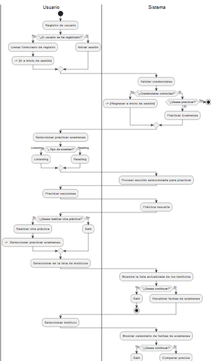
      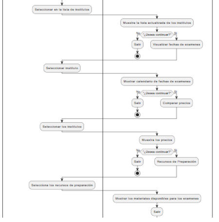

      **Diagrama 01:** El diagrama representa el flujo.
   

---

4. #### Especificación de Requerimientos de Software

   1) ##### **Cuadro de Requerimientos Funcionales Inicial** {#cuadro-de-requerimientos-funcionales-inicial}

   | Código | Requerimiento | Descripción | Prioridad |
   | :---: | :---: | ----- | :---: |
   | RF-01 | Registrar usuario | Permitir a los usuarios crear una cuenta mediante un formulario de registro. | Alta |
   | RF-02 |Iniciar sesión | Facilitar el acceso a los usuarios mediante un sistema de inicio de sesión. | Alta |
   | RF-03 | Practicar exámenes. | Permitir a los usuarios practicar secciones específicas de los exámenes (listening, reading). | Alta |
   | RF-04 | Consultar institutos | Mostrar una lista de institutos de certificación, incluyendo ubicación y características. | Media |
   | RF-05 | Visualizar fechas de exámenes | Proporcionar un calendario con las fechas de los exámenes disponibles. | Media |
   | RF-06 | Comparar precios | Permitir a los usuarios comparar precios de exámenes entre diferentes institutos. | Alta |
   | RF-07 | Acceder a recursos de preparación | Proveer materiales y recursos para la preparación de los exámenes.| Media |
   

   2) ##### **Cuadro de Requerimientos No Funcionales** {#cuadro-de-requerimientos-no-funcionales}

   | Código   | Requerimiento                   | Descripción |
   |----------|----------------------------------|-------------|
   | RNF-01   | Interfaz amigable | La aplicación debe tener una UI intuitiva y fácil de navegar para mejorar la experiencia del usuario. |
   | RNF-02   | Seguridad         | Implementar medidas de seguridad para proteger la información personal y las credenciales de los usuarios. |
   | RNF-03   | Rendimiento        | La aplicación debe cargar rápidamente y ser responsiva para una buena experiencia de uso. |
   | RNF-04   | Compatibilidad        | La arquitectura debe permitir la adición de nuevas funcionalidades sin afectar el rendimiento. |

   3) ##### **Cuadro de Requerimientos Funcionales Final**

   | Código | Requerimiento | Descripción | Prioridad |
   | :---: | :---: | ----- | :---: |
   | RF-01 | Registrar usuario | Permitir a los usuarios crear una cuenta mediante un formulario de registro. | Alta |
   | RF-02 |Iniciar sesión | Facilitar el acceso a los usuarios mediante un sistema de inicio de sesión. | Alta |
   | RF-03 | Practicar exámenes. | Permitir a los usuarios practicar secciones específicas de los exámenes (listening, reading). | Alta |
   | RF-04 | Consultar institutos | Mostrar una lista de institutos de certificación, incluyendo ubicación y características. | Media |
   | RF-05 | Visualizar fechas de exámenes | Proporcionar un calendario con las fechas de los exámenes disponibles. | Media |
   | RF-06 | Comparar precios | Permitir a los usuarios comparar precios de exámenes entre diferentes institutos. | Alta |
   | RF-07 | Acceder a recursos de preparación | Proveer materiales y recursos para la preparación de los exámenes.| Media |

   4) ##### **Reglas de Negocio** {#reglas-de-negocio}

    -Validación de Usuarios: Todos los usuarios deben registrarse y validar su identidad antes de acceder a las funciones de la aplicación.
    - Acceso a Información: La información sobre institutos y exámenes debe ser verificada y actualizada regularmente para garantizar su precisión.
    - Privacidad de Datos: La aplicación debe cumplir con las normativas de protección de datos, asegurando que la información personal de los usuarios esté protegida.
    - Limitaciones en la Práctica: Los usuarios pueden practicar secciones específicas de exámenes, pero pueden tener limitaciones en el número de intentos para evitar abusos.
    - Comparación de Precios: Los precios mostrados en la aplicación deben reflejar las tarifas oficiales de los institutos y ser actualizados periódicamente.

5. #### Fases de Desarrollo

   1. ##### **Perfiles de Usuario** {#perfiles-de-usuario}

   - <strong>Usuario estándar:</strong> Persona interesada en prepararse para exámenes de certificación en inglés, cuyo principal objetivo es practicar mediante simulaciones, mejorar sus habilidades lingüísticas y acceder a información actualizada sobre instituciones certificadoras y fechas de exámenes. Para ello, puede registrarse en la plataforma y gestionar su perfil, acceder a simulaciones de exámenes, consultar información relevante sobre institutos y cronogramas, visualizar su progreso de preparación y recibir retroalimentación personalizada que le ayude a fortalecer sus áreas de mejora.

   2. ##### **Modelo Conceptual** {#modelo-conceptual}

      1) ##### Diagrama de Paquetes {#diagrama-de-paquetes}

      El diagrama presenta la estructura de la aplicación Simulapp.

      

      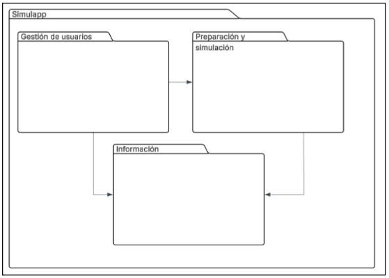  

      **Diagrama 02:** Diagrama de paquetes. 
      **Fuente:** Elaboración propia.
      

      2) ##### Diagrama de Casos de Uso {#diagrama-de-casos-de-uso}

      Este diagrama de casos de uso representa las funcionalidades de la aplicación Simulapp

      

      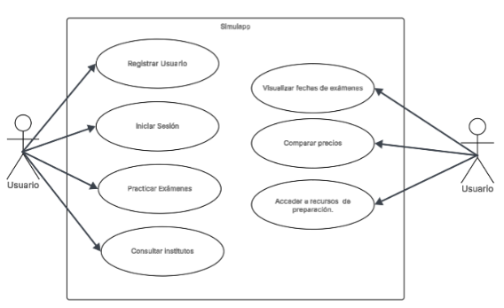

      **Diagrama 03:** Diagrama de Casos de Uso. 
      **Fuente:** Elaboración propia.
      

      3) ##### **Escenarios de Caso de Uso (Narrativa)** {#escenarios-de-caso-de-uso-(narrativa)}

      **Narrativa de CU - 01:** “Registrar Usuario”

      

      

      

      **Narrativa de CU - 02:** “Iniciar Sesión”

      

      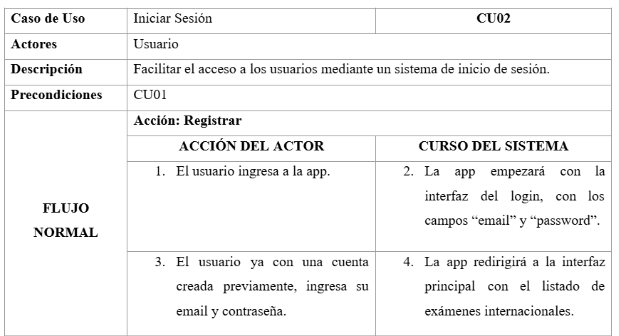
      

      **Narrativa de CU - 03:** “Practicas exámenes”

      

      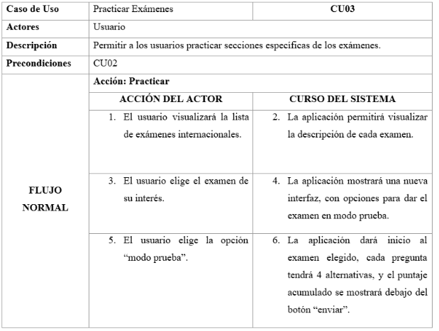

      

      **Narrativa de CU - 04:** “Consultar institutos”

      

      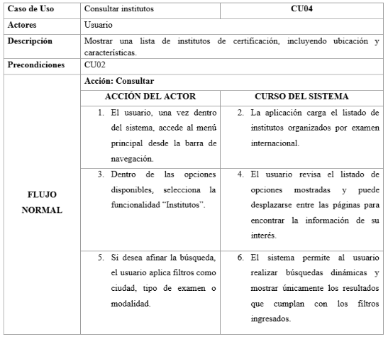
    
      

      **Narrativa de CU - 05:** “Visualizar fechas de exámenes”

      

      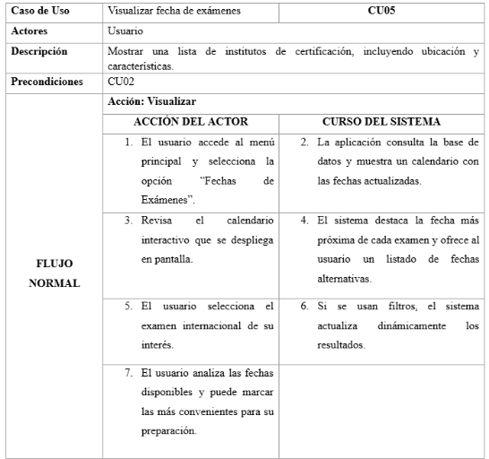

      

      **Narrativa de CU - 06:** “Comparar precios”

      

      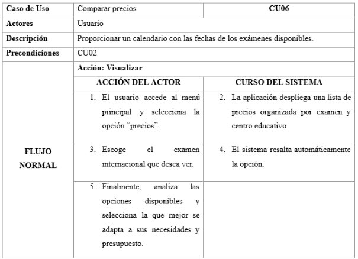

      

      **Narrativa de CU - 07:** “Acceder a recursos de preparación”

      

      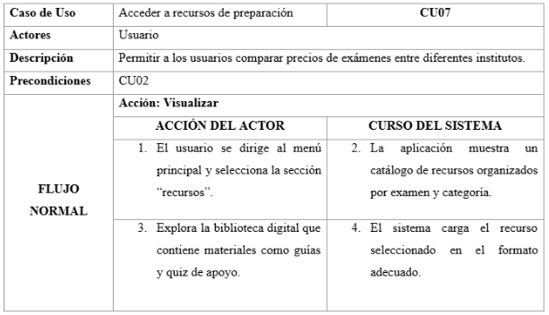
      

   3. ##### **Modelo Lógico** {#modelo-lógico}

      1) ##### Análisis de Objetos {#análisis-de-objetos}

      Objetos Entidad:

      

      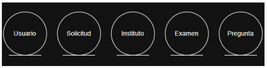

      **Gráfico 03:** Objetos entidad de simulapp.
       
      **Fuente:** Elaboración propia.
      

      Objetos Frontera:

      

      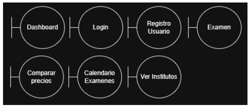

      **Gráfico 04:** Objetos frontera de simulapp.
       
      **Fuente:** Elaboración propia.
      

      Objetos Control:

      

      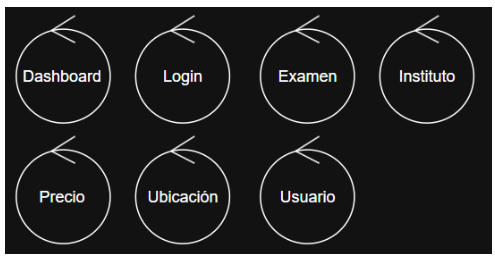

      **Gráfico 05:** Objetos control de simulapp.
       
      **Fuente:** Elaboración propia.
      

      2) ##### Diagrama de Actividades con Objetos {#diagrama-de-actividades-con-objetos}

      

      
      Caso de uso 01: Registrar usuario
      
      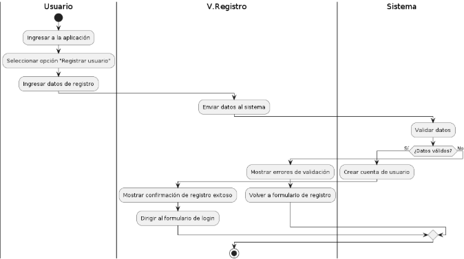

      **Diagrama 04:** Diagrama de actividades con objetos del caso de uso 01.
       
      **Fuente:** Elaboración propia.
      

      

      
      Caso de uso 02: Iniciar sesión
      
      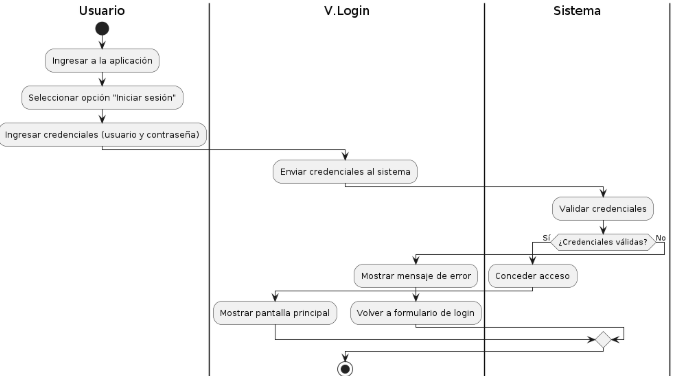

      **Diagrama 05:** Diagrama de actividades con objetos del caso de uso 02.
       
      **Fuente:** Elaboración propia.
      

      
      

      
      Caso de uso 03: Practicar examenes
      
      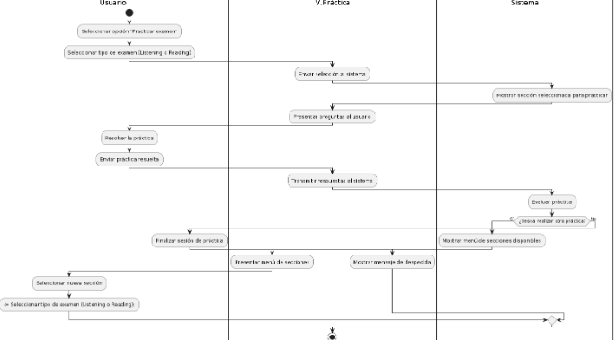

      **Diagrama 06:** Diagrama de actividades con objetos del caso de uso 03.
       
      **Fuente:** Elaboración propia.
      

      
      

      
      Caso de uso 04: Consultar institutos
      
      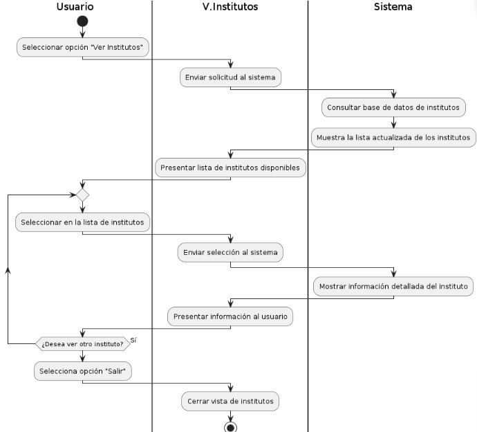

      **Diagrama 07:** Diagrama de actividades con objetos del caso de uso 04.
       
      **Fuente:** Elaboración propia.
      

      
      

      
      Caso de uso 05: Visualizar fecha de exámenes
      
      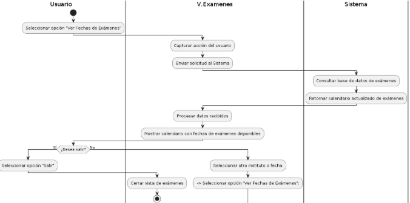

      **Diagrama 08:** Diagrama de actividades con objetos del caso de uso 05.
       
      **Fuente:** Elaboración propia.
      

      
      

      
      Caso de uso 06: Comparar precios
      
      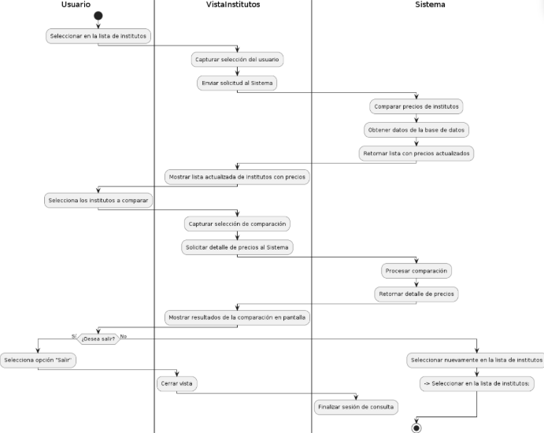

      **Diagrama 09:** Diagrama de actividades con objetos del caso de uso 06.
       
      **Fuente:** Elaboración propia.
      

      
      

      
      Caso de uso 07: Acceder a recursos de preparación
      
      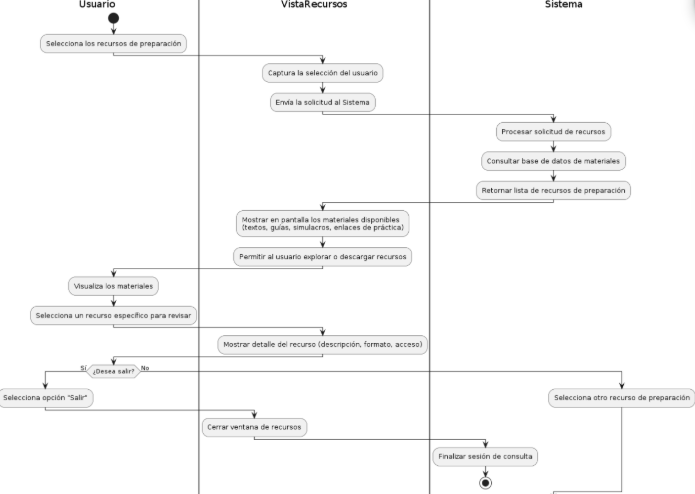

      **Diagrama 10:** Diagrama de actividades con objetos del caso de uso 07.
       
      **Fuente:** Elaboración propia.
      

      3) ##### Diagrama Secuencia {#diagrama-secuencia}

      

      
      Diagrama de secuencia CU - 01: Registrar usuario
      
      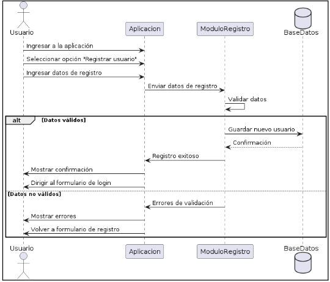

      **Diagrama 11:**  Diagrama de secuencia del caso de uso 01.
       
      **Fuente:** Elaboración propia.
      

      

      
      Diagrama de secuencia CU - 02: Iniciar sesión
      
      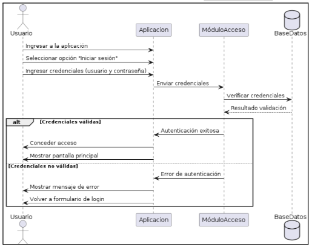

      **Diagrama 12:**  Diagrama de secuencia del caso de uso 02.
       
      **Fuente:** Elaboración propia.
      

      

      
      Diagrama de secuencia CU - 03: Practicar exámenes
      
      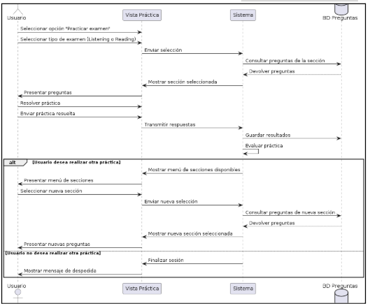

      **Diagrama 13:**  Diagrama de secuencia del caso de uso 03.
       
      **Fuente:** Elaboración propia.
      

      

      
      Diagrama de secuencia CU - 04: Consultar institutos
      
     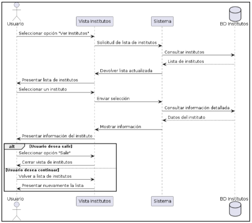

      **Diagrama 14:**  Diagrama de secuencia del caso de uso 04.
       
      **Fuente:** Elaboración propia.
      

      

      
      Diagrama de secuencia CU - 05: Visualizar fecha de exámenes
      
      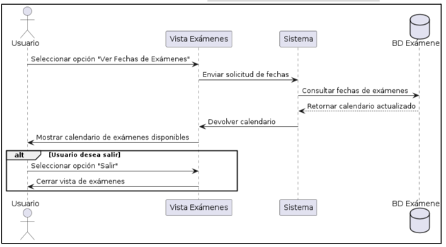

      **Diagrama 15:**  Diagrama de secuencia del caso de uso 05.
       
      **Fuente:** Elaboración propia.
      

      

      
      Diagrama de secuencia CU - 06: Comparar precios
      
      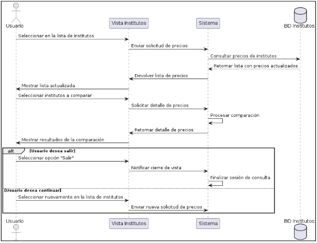

      **Diagrama 16:**  Diagrama de secuencia del caso de uso 06.
       
      **Fuente:** Elaboración propia.
      

      

      
      Diagrama de secuencia CU - 07: Acceder a recursos de preparación
      
      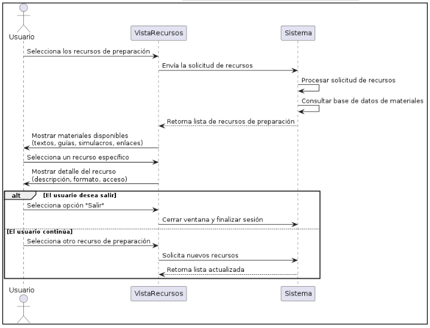

      **Diagrama 17:**  Diagrama de secuencia del caso de uso 07.
       
      **Fuente:** Elaboración propia.
      

      4) ##### Diagrama de Clases ([Link a Diagrama de Clases])  {#diagrama-de-clases-(link-a-diagrama-de-clases)}

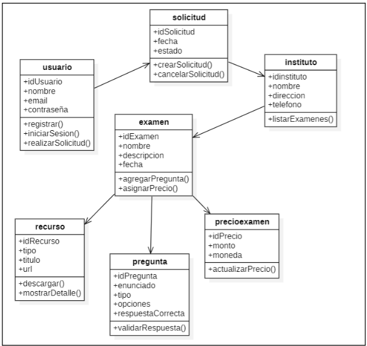 

**Diagrama 18:** El Diagrama de Clases muestra la interacción entre usuarios, administradores, empresas, egresados, ofertas laborales y postulaciones.

---

### **Conclusiones**

  En conclusión, la especificación de requerimientos presentada para Simulapp establece de manera clara las funcionalidades y restricciones necesarias para desarrollar una aplicación confiable y efectiva que simule exámenes de certificación de inglés. Este documento garantiza que el sistema atenderá las necesidades de los estudiantes, ofreciendo una experiencia de aprendizaje interactiva y precisa, al mismo tiempo que proporciona criterios claros para la implementación, pruebas y validación, asegurando que el proyecto sea técnicamente viable, útil y de alta calidad.

### **Recomendaciones**

   - <strong>Implementar evaluaciones adaptativas:</strong> Incorporar algoritmos que ajusten la dificultad de los simulacros según el desempeño del usuario, lo que permitirá un aprendizaje más personalizado y efectivo.

   - <strong>Mantener la actualización de contenidos:</strong> Garantizar que los exámenes simulados reflejen los cambios y formatos de las certificaciones oficiales de inglés, asegurando la relevancia y validez del entrenamiento para los estudiantes.
